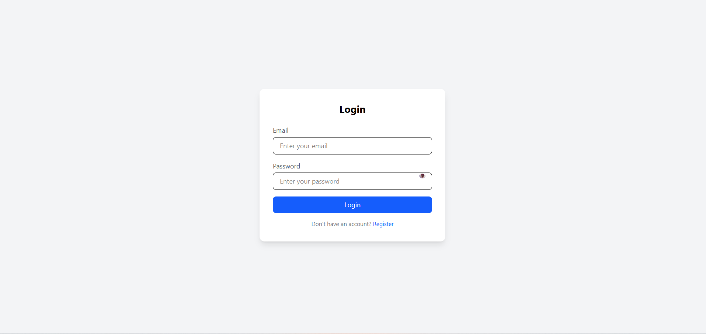
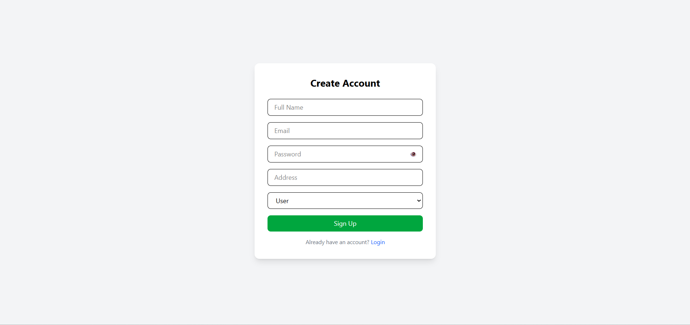
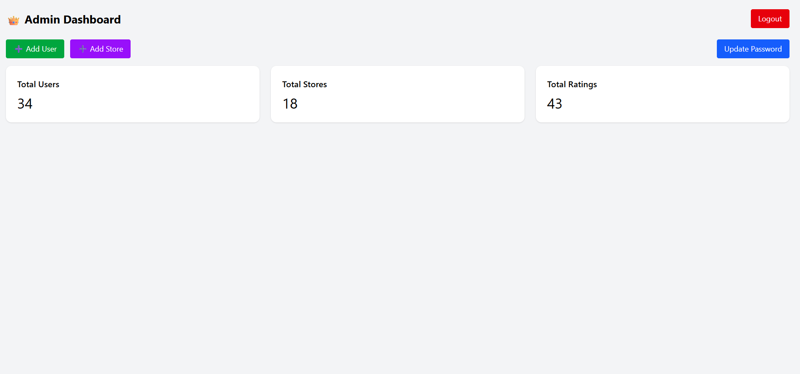
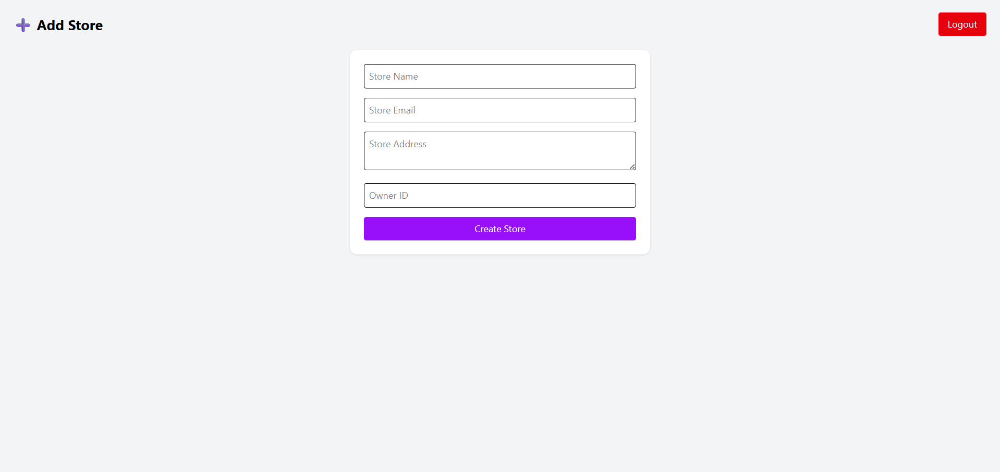
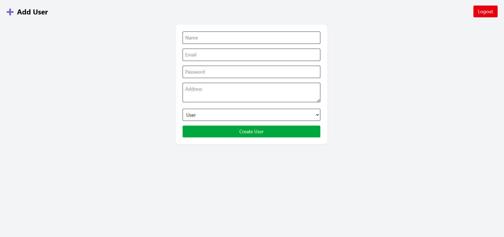
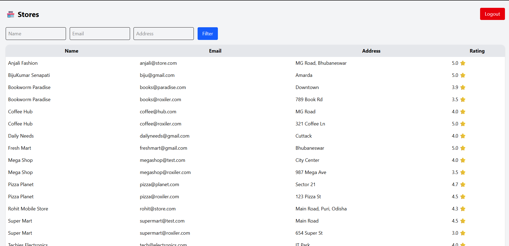
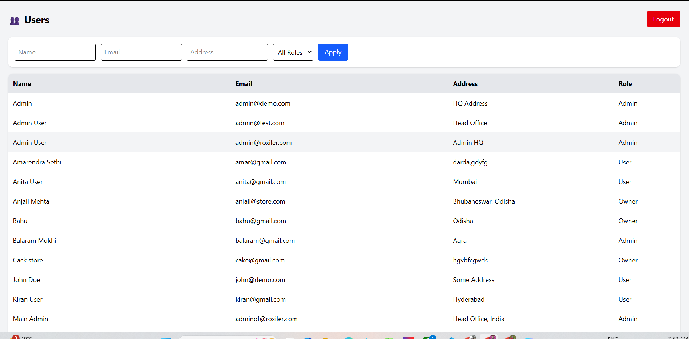
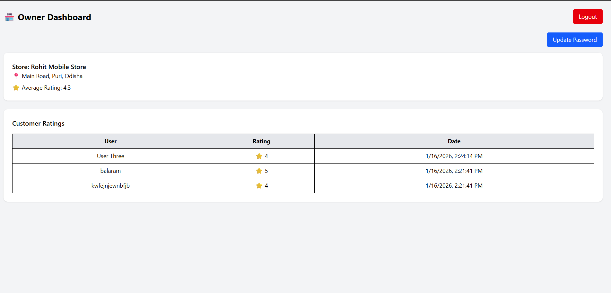
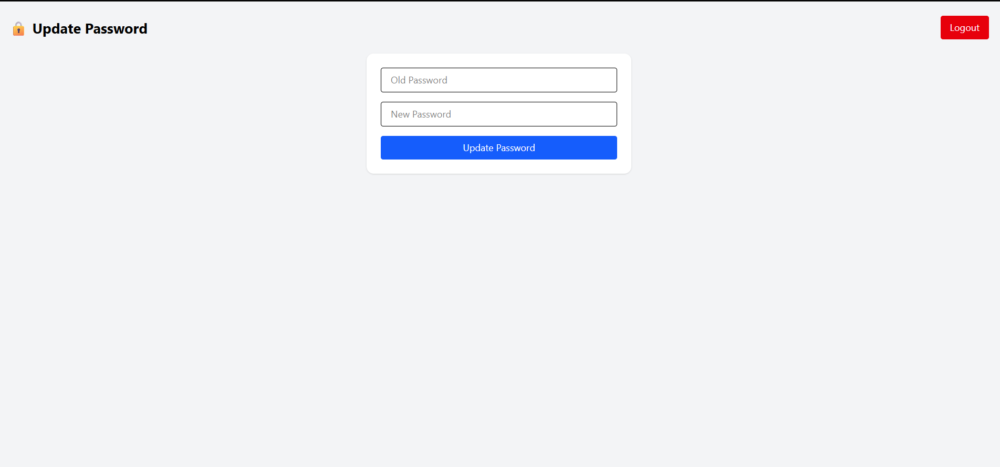
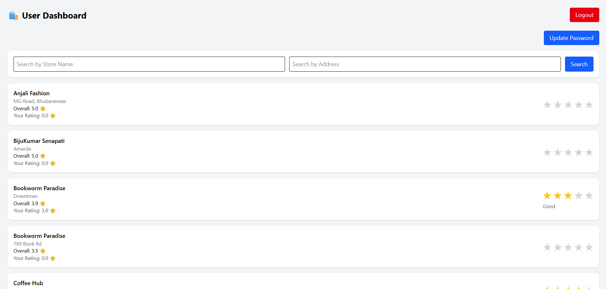

# Store Platform – Full Stack Web Application

A full-stack web application that allows users to rate registered stores. The platform supports three roles: **Admin**, **Store Owner**, and **Normal User**, each with specific permissions and dashboards.

---

## 🚀 Features

### 👤 Normal User

* Sign up and login
* View all registered stores
* Search stores by name and address
* Submit ratings (1–5)
* Update their submitted rating
* View their own submitted ratings
* Update password
* Logout

---

### 🏪 Store Owner

* Login
* View their own store
* View all ratings given to their store
* See average store rating
* Update password
* Logout

---

### 🛠 Admin

* Login
* Dashboard with total users, stores, and ratings
* Add new users
* Add new stores
* View all users
* View all stores
* View all ratings
* Update password
* Logout

---

## 🧱 Tech Stack

### Frontend

* React (Vite)
* Tailwind CSS
* Axios
* React Router

### Backend

* Node.js
* Express.js
* SQLite
* JWT Authentication
* bcrypt
* Rate limiting middleware

---

## 📁 Folder Structure

### Backend

```
src/
│── app.js
│── server.js
│── seed.js
│
├── config/
│   └── db.js
│
├── controllers/
│   ├── admin.controller.js
│   ├── auth.controller.js
│   ├── owner.controller.js
│   └── user.controller.js
│
├── middlewares/
│   ├── auth.middleware.js
│   ├── role.middleware.js
│   └── rateLimit.middleware.js
│
├── models/
│   ├── initDB.js
│   ├── user.model.js
│   ├── store.model.js
│   └── rating.model.js
│
├── routes/
│   ├── admin.routes.js
│   ├── auth.routes.js
│   ├── owner.routes.js
│   └── user.routes.js
│
└── utils/
    └── validators.js
```

---

### Frontend

```
src/
│── api/
│   └── axios.js
│
├── adminUtils/
│   ├── AdminAddUser.jsx
│   ├── AdminAddStore.jsx
│   ├── AdminUsers.jsx
│   ├── AdminStores.jsx
│   ├── AdminRatings.jsx
│   └── AdminUserDetails.jsx
│
├── components/
│   ├── ProtectedRoute.jsx
│   ├── LogoutButton.jsx
│   └── StarRating.jsx
│
├── pages/
│   ├── Login.page.jsx
│   ├── Signup.page.jsx
│   ├── Dashboard.page.jsx
│   ├── AdminDashboard.page.jsx
│   ├── OwnerDashboard.page.jsx
│   ├── UserDashboard.page.jsx
│   ├── Stores.page.jsx
│   ├── Ratings.page.jsx
│   └── UpdatePassword.page.jsx
│
├── App.jsx
├── main.jsx
└── index.css
```

---

## ⚙️ Setup Instructions

### 1️⃣ Clone the Repository

```bash
git clone <https://github.com/balarammukhi245-create/roxiler-fullstack-js-app>
cd roxiler-fullstack-js-app
```

---

### 2️⃣ Backend Setup

```bash
cd backend
npm install
```

Create a `.env` file:

```
PORT=5000
JWT_SECRET=your_secret_key
```

Run the backend:

```bash
npm run dev
```

---

### 3️⃣ Frontend Setup

```bash
cd frontend
npm install
npm run dev
```

---

## 🔐 Authentication

* JWT-based authentication
* Role-based access control
* Token stored in localStorage
* Auto logout on token expiry

---

## 🗄 Database

* SQLite
* Tables:

  * users
  * stores
  * ratings

Each rating is unique per user per store.

---

## 📡 API Endpoints (Summary)

### Auth

| Method | Route                     | Description     |
| ------ | ------------------------- | --------------- |
| POST   | /api/auth/signup          | User signup     |
| POST   | /api/auth/login           | Login           |
| PATCH  | /api/auth/update-password | Update password |

---

### Admin

| Method | Route              | Description     |
| ------ | ------------------ | --------------- |
| POST   | /api/admin/users   | Add user        |
| POST   | /api/admin/stores  | Add store       |
| GET    | /api/admin/users   | Get all users   |
| GET    | /api/admin/stores  | Get all stores  |
| GET    | /api/admin/ratings | Get all ratings |
| GET    | /api/admin/stats   | Dashboard stats |

---

### User

| Method | Route            | Description     |
| ------ | ---------------- | --------------- |
| GET    | /api/user/stores | View all stores |
| POST   | /api/user/rate   | Rate a store    |
| PATCH  | /api/user/rate   | Update rating   |

---

### Owner

| Method | Route               | Description        |
| ------ | ------------------- | ------------------ |
| GET    | /api/owner/my-store | View own store     |
| GET    | /api/owner/ratings  | View store ratings |

---

## 🧪 Test Credentials

You can add test users using `seed.js` or manually via Admin dashboard.

---

## 📸 Screenshots

### Login Page



### Signup Page



### Admin Dashboard



### Admin Add Store



### Admin Add User



### Admin Store list



### Admin User list



### Store owner dashboard



### Update password



### User Dashboard




---

## 🌍 Deployment

### Backend – Render

* Create a new Web Service
* Root directory: `backend`
* Build command: `npm install`
* Start command: `node src/server.js`
* Add environment variables

---

### Frontend – Vercel

* Import GitHub repo
* Root: `frontend`
* Framework: Vite
* Add environment variable:

```
VITE_API_URL=https://your-backend-url.onrender.com/api
```

---

## ⚠️ Validations & Edge Cases

* Email uniqueness enforced
* Rating range: 1–5
* One rating per user per store
* Role-based route protection
* Token expiry handling
* Rate limiting on login
* Password hashing using bcrypt

---

## 📦 Submission Checklist

* [x] GitHub repo
* [x] Clean code structure
* [x] README.md
* [x] Setup instructions
* [x] API documentation
* [x] Screenshots
* [x] Deployed links
* [x] Tested edge cases

---

## 👨‍💻 Author

**Name:** Balaram
**Role:** Full Stack Developer
**Project:** Roxiler Full Stack Assignment

---
